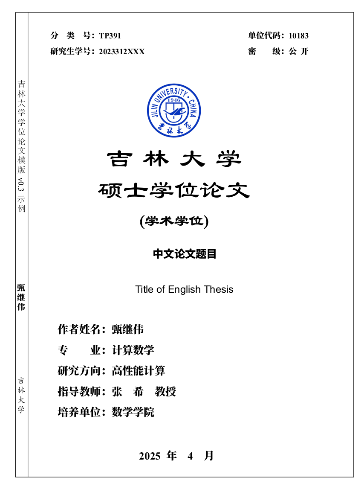

# JLU 论文模板
# 免责声明
> 此模板为个人根据学校要求实现，未得到学校任何相关人员的认证，使用者应当自行承担一切后果。

# 学位论文撰写规范
[吉林大学研究生学位论文撰写及装帧规范(2023年03)](http://lib.jlu.edu.cn/portal/service/lwtjxt/2666.aspx)

# 使用
## 0.准备工作
- [网络安装 TexLive](https://www.bilibili.com/video/BV1Zg4y1g7pp?spm_id_from=333.788.videopod.sections)
- [ios镜像安装TexLive2023](https://www.bilibili.com/video/BV1Zs4y1N7gJ/?spm_id_from=333.1387.search.video_card.click)
- [[emacs] 编写Latex文档](https://www.bilibili.com/video/BV1Py4y1E7Zp?spm_id_from=333.788.player.switch&p=2)
- [[vim] 编写Latex文档](https://www.bilibili.com/video/BV12X4y1V7VP?spm_id_from=333.788.videopod.episodes&p=2)
- [latexmk的配置](https://github.com/IammyselfYBX/.dotfile?tab=readme-ov-file#latex)

## 1.下载
```bash
$> git clone git@github.com:IammyselfYBX/JLU_TLT.git
```
或
```bash
$> git clone https://github.com/IammyselfYBX/JLU_TLT.git
```

## 2.安装字体
> 这里是使用 https://github.com/Haixing-Hu/latex-chinese-fonts# 的字体

### *nix/Windows WSL 方式
```bash
$> sudo mkdir -p /usr/share/fonts/latex_cnfonts
$> sudo cp ./fonts/*/*/*/* /usr/share/fonts/latex_cnfonts
$> cd /usr/share/fonts/latex_cnfonts
$> mkfontscale && mkfontdir && fc-cache -fv
```

### Windows方式
将 ```fonts``` 目录下的字体复制到 ```C:\Windows\Fonts```

## 3.编译
### \[推荐\] 使用latexmk
```bash
latexmk -f main.tex 
```

# 说明
## 目录结构
```bash
.
|-- figuers 				# 存放图片
|-- fonts 					# [第三方]存放字体
|-- etc						# 暂时未归类的文件
|-- scripts 				# 常用脚本
|-- jluthesis2023.sty		# 2023版的模板文件
|-- main.tex 				# 主文件(根据自己情况修改)
|-- part 					# 各部分文件(根据自己情况修改)
|-- references.bib 			# 参考文献(根据自己情况修改)
|-- gbt7714.sty				# 参考文献样式
|-- gbt7714-author-year.bst # 参考文献作者年的样式
|-- gbt7714-numerical.bst 	# 参考文献数字的样式
`-- README.md 				# 说明文档
```
## 最终结果
文档主题在 [part](part) 下各文件。
<details>
<summary>
图例
</summary>

</details>

使用示例见 [example.tex](example.tex)。

- 选项

	可用选项有 `debug|ebook|hardcopy`，`amd|pmd|phdplain|phdfancy`，`nobox`， `manualSpine`， `onlyCover`， `twoSideCover`,  `noBlankPages`。

	|选项|作用|
  |:---:|---|
  |debug| 生成的PDF带框线，方便调试|
  |ebook| 带彩色文字的PDF|
  |hardcopy| 无彩色文字的PDF|
  |amd| 学术学位硕士使用|
  |pmd |专业学位硕士使用|
  |phdplain| 博士简装版使用|
  |phdfancy |博士精装版使用|
  |nobox | 输出的封面无框线和书脊|
  |manualSpine |手动输出书脊|
  |onlyCover | 仅输出封面页|
  |twoSideCover | 输出双页封面|
  |noBlankPages  | 去掉空白页，主要用于上传到图书馆学位论文系统|
	
	默认为 `hardcopy,amd`，且 `nobox=false, manualSpine=false, onlyCover=false, twoSideCover=false, noBlankPages=false`

	举例如下
	```
	\usepackage[phdplain,ebook,twoSideCover,onlyCover]{jluthesis2023}
	\usepackage[amd,hardcopy,twoSideCover]{jluthesis2023}
	\usepackage[amd,hardcopy]{jluthesis2023}
	```

- 单面印刷需设置 documentclass 为 oneside (如`\documentclass[twoside,a4paper,12pt]{book}`)，双面印刷需设置 documentclass 为 twoside (如`\documentclass[oneside,a4paper,12pt]{book}`)。
- 建议安装 TeX Live 并使用 XeLaTeX 编译。<br/>
  校内可在[吉大镜像站](https://mirrors.jlu.edu.cn/CTAN/systems/texlive/tlnet/install-tl.zip)下载 TeX Live。
- 若缺少字体需自行安装 (见[fonts.txt](fonts.txt))。所需字体如下：
	- Adobe Song Std，Adobe Heiti Std，Adobe Kaiti Std，Adobe Fangsong Std
	- Nimbus Roman，Nimbus Sans，Nimbus Mono
	- Source Han Sans(思源黑体)，Source Han Serif(思源宋体)
	- LiSu (隶书)

	安装字体后，可运行 `fc-cache` 刷新字体缓存，可通过 ` fc-list : family | sort ` 查看已安装字体。<br/>
    这两个命令均随 TeX Live 安装，Windows 下在如 `C:\texlive\2020\bin\win32` 的文件夹下可找到，可将该文件夹添加进 PATH 环境变量。<br/> 
    若编译时提示找不到字体，先检查字体是否已安装，再检查字体名称是否一致。
- 若要使用此模板生成的 PDF 文档查重，需确保 PDF 能够正常复制出汉字。

- 要生成 MS Word 文档，可使用 pandoc 或 Adobe Acrobat DC，也可直接用 MS Word 打开 PDF 得到 Word 文档，只是这三种方式得到的 Word 文档质量不同。

- 查重时可能会把原创声明、授权声明、参考文献、致谢等包括进去，可使用 `makeCrosscheckVersion.sh` 制作查重版本，生成的 PDF 文档中原创声明、授权声明、作者简介、致谢四部分的文字被转换为路径，因此这四部分无法导出无法复制，也就不会参与查重。之所以没将参考文献也做成不可复制的，是觉得查重系统会从这里面提取引用。<br/>
	- 使用方法：
	```bash
	chmod a+x makeCrosscheckVersion.sh
	./makeCrosscheckVersion.sh example  # example为PDF文件名，不包括扩展名
	```
	- 执行此脚本需
	    - 安装 [pdftk](https://www.pdflabs.com/tools/pdftk-the-pdf-toolkit/)、[Ghostscript](https://www.ghostscript.com/download/gsdnld.html) 并将其路径加入 PATH 环境变量。
	    - 将 TeX Live 可执行文件路径加入 PATH 环境变量。
	    - 有类 Linux 环境，可执行 cat、grep、awk、head 等命令。Windows下安装 [Git](https://git-scm.com/downloads) 并使用 Git Bash 可得到。

- 思源宋体粗体可能看起来与 MS Word 中的粗体差别较大。若以假粗体实现粗体来生成的文档大概更接近 MS Word 的感觉，但似乎偶尔会出现奇奇怪怪的问题 (如部分字无法选中、该加粗的字没有加粗、不该加粗的字被加粗了等)，不过好在只有封面、摘要、章节题目等少数几个地方需要使用粗体。使用假粗体需在 documentclass 中设置 AutoFakeBold， 在 jluthesis2023 中设置 manualSpine，并需重置 CJKmainfont，具体见 [amd-ebook-oneside-假粗体.tex](example_files/amd-ebook-oneside-假粗体.tex)。本人所提交的论文采用假粗体方案。

# 相关项目
[吉林大学答辩Beamer模板](https://github.com/IammyselfYBX/JLUbeamer)


# 参考
- [吉林大学硕博学位论文 LaTeX 模板——jluthesis2023](https://github.com/maxuewei2/jluthesis2023)
- 本科毕业论文：[x86vk/JLU-CCST-Thesis](https://github.com/x86vk/JLU-CCST-Thesis)
- 硕士毕业论文：[jiafeng5513/JLU_Dissertation](https://github.com/jiafeng5513/JLU_Dissertation)

