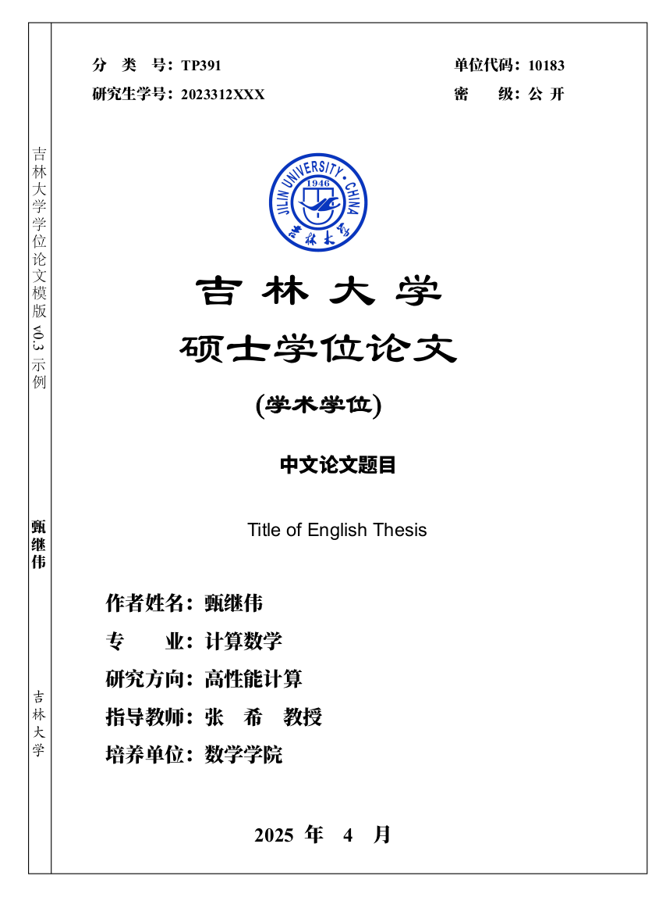

# 吉林大学硕博论文 TeX 模板
Template Package for Writing Thesis for Jilin University by Jiwei Zhen.

# 免责声明
> 此模板为个人根据学校要求实现，未得到学校任何相关人员的认证，使用者应当自行承担一切后果。


# 学位论文撰写规范
[吉林大学研究生学位论文撰写及装帧规范(2023年03)](http://lib.jlu.edu.cn/portal/service/lwtjxt/2666.aspx)<br>
[[备份]吉林大学研究生学位论文撰写及装帧规范(2023年03)](http://lib-old.jlu.edu.cn/portal/service/lwtjxt/2666.aspx)<br>


# 使用
## 0.准备工作
- 建议安装 TeX Live 并使用 XeLaTeX 编译。<br/>
  校内可在[吉大镜像站](https://mirrors.jlu.edu.cn/CTAN/systems/texlive/tlnet/install-tl.zip)下载 TeX Live。
- [网络安装 TexLive](https://www.bilibili.com/video/BV1Zg4y1g7pp?spm_id_from=333.788.videopod.sections)
- [ios镜像安装TexLive2023](https://www.bilibili.com/video/BV1Zs4y1N7gJ/?spm_id_from=333.1387.search.video_card.click)
- [[emacs] 编写Latex文档](https://www.bilibili.com/video/BV1Py4y1E7Zp?spm_id_from=333.788.player.switch&p=2)
- [[vim] 编写Latex文档](https://www.bilibili.com/video/BV12X4y1V7VP?spm_id_from=333.788.videopod.episodes&p=2)
- [latexmk的配置](https://github.com/IammyselfYBX/.dotfile?tab=readme-ov-file#latex)


## 1.下载
```bash
$> git clone git@github.com:IammyselfYBX/JLU_TLT.git
```
或
```bash
$> git clone https://github.com/IammyselfYBX/JLU_TLT.git
```

## 2.安装字体
具体见 [字体说明](fonts/README.md),所需字体如下：
  - Adobe Song Std，Adobe Heiti Std，Adobe Kaiti Std，Adobe Fangsong Std
  - Nimbus Roman，Nimbus Sans，Nimbus Mono
  - Source Han Sans(思源黑体)，Source Han Serif(思源宋体)
  - LiSu (隶书)

若缺少字体需自行安装 (见[fonts.txt](fonts/fonts.txt))。
> 这里是使用 https://github.com/Haixing-Hu/latex-chinese-fonts# 的字体

### *nix/Windows WSL 方式
```bash
$> sudo mkdir -p /usr/share/fonts/latex_cnfonts
$> sudo cp ./fonts/*/*/*/* /usr/share/fonts/latex_cnfonts
$> cd /usr/share/fonts/latex_cnfonts
$> mkfontscale && mkfontdir && fc-cache -fv
```

> 视频教程<br>
> [macOS安装字体](https://www.bilibili.com/video/BV1Px4y1k7eA/)<br>
> [Arch Linux安装字体](https://www.bilibili.com/video/BV1ea4y1N7TG/)<br>
> [Linux 字体操作](https://www.bilibili.com/video/BV1N34y167vb/)<br>
> [[Linux] Latex使用Times New Roman](https://www.bilibili.com/video/BV1i44y1r7HW)<br>

### Windows方式
- [方法一] 将 `fonts` 目录下的字体复制到 `C:\Windows\Fonts`

- [方法二] 在如 `C:\texlive\2020\bin\win32` 的文件夹下可找到，可将该文件夹添加进 `PATH` 环境变量。<br/> 

## 3.模板使用
### 目录结构
```bash
.
|-- fonts 				# [第三方]存放字体
|-- etc					# [不要修改] 暂时未归类的文件
|-- scripts 			# [不要修改] 常用脚本
|-- style               # [谨慎修改] 样式文件
|    |--jluthesis2023.sty 	# 2023版的模板文件
|    |-- gbt7714.sty		# 中国国家标准GB/T 7714的参考文献格式
|    |-- gbt7714-author-year.bst 	# 参考文献作者年的样式
|    `-- gbt7714-numerical.bst 		# 参考文献数字的样式
|-- figures 			# [自行修改] 存放图片
|    |-- module             # [不要修改] 封面LOGO等图标
|    |-- author.png         # [自行修改] 作者签名
|    |-- author_tutor.png   # [自行修改] 导师签名
|    `-- chapter            # [自行修改] 各个章节的图片
|-- jluthesis.cfg 		# [自行修改] 配置文件
|-- main.tex 			# [自行修改] 主文件
|-- part 				# [自行修改] 各部分文件
|-- references.bib 		# [自行修改] 参考文献
`-- README.md 			# 说明文档
```

### 修改配置文件
`jluthesis.cfg`文件包含了论文作者、专业、日期等信息，请根据实际情况修改。

### 签名
在 `figures` 目录下放置作者和导师的签名图片，命名为 `author.png` 和 `author_tutor.png`

注意：文件格式必须是 png 。

### 修改正文
#### 引入章节
正文内容在 [part](part) 目录下的各个 tex 文件中，按需新建。
```bash
$> cd part 
$> touch chapter1绪论.tex chapter2相关理论与关键技术.tex
```

然后在 `main.tex` 中按需引入 [part](part) 目录下的各个 tex 文件,具体格式如下

```latex
\input{part/chapter1绪论.tex} 				% 第1章 绪论
\input{part/chapter2相关理论与关键技术.tex}	 % 第2章 相关理论与关键技术
```

#### 插入图片
为了保证项目的整洁，建议将各个章节用到的图片放在 `figures` 目录下,然后引入图片的方式如下
```latex 
\begin{figure}[htbp]
  \centering
  \includegraphics[width=0.8\textwidth]{figures/introduction/RESNet18.png} \\
  \caption[ResNet18网络结构示意图]{ResNet18是一个深度卷积神经网络结构} 
  \label{fig:lengthscale}
\end{figure}
```

#### 居中
##### 首行缩进
所有的**居中行**都需要使用`\noindent`来消除首行缩进，并且要在变换字号的命令如 `\sihao` 之后使用，因为`\parindent`被修改了
##### 换行
`{\centering }`需要使用`\\`来断行居中


## 4.编译
### \[推荐\] 使用latexmk
```bash
latexmk -f main.tex 
```

https://github.com/user-attachments/assets/d924c7a5-e1f0-4cb3-8320-bd9d696e0e1d

> 最终结果
> 文档主题在 [part](part) 下各文件。
> <details>
> <summary>
> 图例
> </summary>
> 
> </details>
> 


# 高级操作
默认的配置就是 **学术学位硕士印刷版**，若需其他配置可参考以下说明

## 1.style 样式修改
### 文档可用选项
在`main.tex`中可以设置文档选项，分为一下4大类

- **输出类型选项（互斥，只能选一个）**
  - `debug` - 调试模式，生成带框线的PDF，方便调试布局
  - `ebook` - 电子版模式，带彩色文字的PDF（链接等为彩色）
  - `hardcopy` - 印刷版模式，无彩色文字的PDF（黑白打印友好）

- **学位类型选项（互斥，只能选一个）**
  - `amd` - 学术学位硕士（Academic Master's Degree）
  - `pmd` - 专业学位硕士（Professional Master's Degree）
  - `phdplain` - 博士论文简装版
  - `phdfancy` - 博士论文精装版

- **封面显示选项（可组合使用）**
  - `onlyCover` - 仅输出封面页
  - `twoSideCover` - 输出双页封面（用于制作封皮）
  - `nobox` - 输出的封面无框线和书脊
  - `manualSpine` - 手动输出书脊，需配合`\jluManualSpine`命令
```latex
% 当在选项中指定手动输出书脊时,可用下列命令手动输出书脊进行微调
\jluManualSpine{
% for oneSideCover
\jluPrintVerticallyOneByOne{2.5cm}{-10em}{吉林大学学位论文模板}{0.2in}{}
\jluPrintVerticallySentence{2.5cm}{-26.5em}{\rotatebox{-90}{\jluthesisVersion}}
\jluPrintVerticallyOneByOne{2.5cm}{-30em}{示例}{0.2in}{}
\jluPrintVerticallyOneByOne{2.45cm}{-38em}{ \coverauthor }{0.2in}{\bfseries}
\jluPrintVerticallyOneByOne{2.5cm}{-47em}{ 吉林大学 }{0.2in}{\kai}
% for twoSideCover    
\jluPrintVerticallyOneByOne{23cm}{-10em}{吉林大学学位论文模板}{0.2in}{}
\jluPrintVerticallySentence{23cm}{-26.5em}{\rotatebox{-90}{\jluthesisVersion}}
\jluPrintVerticallyOneByOne{23cm}{-30em}{示例}{0.2in}{}
\jluPrintVerticallyOneByOne{23cm}{-38em}{ \coverauthor }{0.2in}{\bfseries}
\jluPrintVerticallyOneByOne{23cm}{-47em}{ 吉林大学 }{0.2in}{\kai}
} 
```
  

- **页面处理选项**
  - `noBlankPages` - 去掉空白页，主要用于上传到图书馆学位论文系统

|选项|作用|
|:---:|---|
|debug| 生成的PDF带框线，方便调试|
|ebook| 带彩色文字的PDF|
|hardcopy| 无彩色文字的PDF|
|amd| 学术学位硕士使用|
|pmd |专业学位硕士使用|
|phdplain| 博士简装版使用|
|phdfancy |博士精装版使用|
|nobox | 输出的封面无框线和书脊|
|manualSpine |手动输出书脊|
|onlyCover | 仅输出封面页|
|twoSideCover | 输出双页封面|
|noBlankPages  | 去掉空白页，主要用于上传到图书馆学位论文系统|

#### 设置文档选项	
默认为 `hardcopy,amd`，且 `nobox=false, manualSpine=false, onlyCover=false, twoSideCover=false, noBlankPages=false`

举例如下
```
% 学术硕士电子版，带双面封面
\usepackage[amd,ebook,twoSideCover]{style/jluthesis2023}

% 专业硕士印刷版，无空白页（用于提交）
\usepackage[amd,hardcopy,noBlankPages]{style/jluthesis2023}

% 博士论文精装版，仅封面
\usepackage[phdfancy,hardcopy,onlyCover]{style/jluthesis2023}

% 调试模式，无框线
\usepackage[debug,amd,nobox]{style/jluthesis2023}

% 博士论文简装版，带彩色文字的PDF，输出双页封面，仅输出封面页
\usepackage[phdplain,ebook,twoSideCover,onlyCover]{jluthesis2023}

% 学术学位硕士，无彩色文字的PDF，输出双页封面
\usepackage[amd,hardcopy,twoSideCover]{jluthesis2023}

% 学术学位硕士，无彩色文字的PDF
\usepackage[amd,hardcopy]{jluthesis2023}
```

> 视频教程<br>
> [twoSideCover双页封面（用于制作封皮）](https://www.bilibili.com/video/BV18BxYzdETP/)<br>
> [noBlankPages提交到图书馆学位论文系统](https://www.bilibili.com/video/BV18BxYzdEKQ/)<br>
> [nobox封面无框线和书脊](https://www.bilibili.com/video/BV1CsxrzqEWB/)<br>

#### 打印设置
在`main.tex`中设置 `documentclass` 的参数 `twoside` 或 `oneside` 来设置打印模式。
- 单面印刷需设置 `documentclass` 为 `oneside` (如`\documentclass[twoside,a4paper,12pt]{book}`)
- 双面印刷需设置 `documentclass` 为 `twoside` (如`\documentclass[oneside,a4paper,12pt]{book}`)。

### 参考文献的样式
本模板一共提供两种参考文献样式，`数字格式`和`作者-年份格式`
```latex
% 1.数字引用模式（[1], [2], [3]）
% 方法一：在包加载时指定
\RequirePackage[sort&compress,numbers]{gbt7714}
% 方法二：加载包后设置
\RequirePackage[sort&compress]{gbt7714}
\citestyle{numbers}

% 2.作者-年份模式（张三(2001), 李四等(2003)）
% 方法一：在包加载时指定
\RequirePackage[sort&compress,authoryear]{gbt7714}
% 方法二：加载包后设置
\RequirePackage[sort&compress]{gbt7714}
\citestyle{authoryear}
```

> 视频教程<br>
> [参考文献样式设置](https://www.bilibili.com/video/BV1hqxYz4EgS/)<br>

## 2.设置论文级别
在`style/jluthesis2023.sty`中通过修改 `\@jlu@mdtrue` 或 `\@jlu@phdtrue` 来设置论文级别
```latex
\@jlu@mdtrue\@jlu@phdfalse  % 默认设置为硕士 
% \@jlu@phdtrue\@jlu@mdfalse  % 默认设置为博士
```

> 视频教程<br>
> [设置论文级别(硕士/博士)](https://www.bilibili.com/video/BV1PsxrzBELz/)<br>


## 3.字体修改
### 设置字体
在 `style/jluthesis2023.sty` 中设置中文字体是开源还是闭源的
```latex
% 闭源字体
\setCJKmainfont{SimSun}                     % 主字体：宋体
\setCJKsansfont{SimHei}                     % 无衬线：黑体
\setCJKmonofont{KaiTi}                      % 等宽字体：楷体

% 开源字体
\setCJKmainfont[BoldFont=Source Han Serif SC Heavy]{Adobe Song Std}    % 主字体：Adobe 宋体，当需要粗体时，使用 思源宋粗体
\setCJKsansfont[BoldFont=Source Han Sans SC Heavy]{Source Han Sans SC} % 无衬线：思源黑体，当需要粗体时，使用 思源黑粗体
\setCJKmonofont{Adobe Kaiti Std}    % 中文数学字体等宽字体：Adobe 楷体
```

在 `style/jluthesis2023.sty` 中设置英文字体是开源还是闭源的
```latex
% 闭源字体
\setmainfont{Times New Roman}       % 英文主要字体是 Times New Roman (衬线)
\setsansfont{Arial}                 % 英文无衬线字体: Arial
\setmonofont{Courier New}           % 等宽字体：Courier New

% 开源字体
%% 方案1：使用 TeX Gyre Pagella
\setmainfont{TeX Gyre Pagella}    % 英文缺省字体：替代 Times New Roman
\setsansfont{TeX Gyre Heros}      % 英文无衬线字体: 替代 Arial
\setmonofont{Courier Std}         % 等宽字体：Adobe Courier Std
%% 方案2：使用 Nimbus 字体族
\setmainfont{Nimbus Roman No9 L}  % 英文缺省字体：替代 Times New Roman
\setsansfont{Nimbus Sans L}       % 英文无衬线字体: 替代 Arial
\setmonofont{Nimbus Mono}         % 等宽字体：Nimbus Mono
```
### 设置假粗体
在 `style/jluthesis2023.sty` 中

思源宋体粗体可能看起来与 MS Word 中的粗体差别较大。若以假粗体实现粗体来生成的文档大概更接近 MS Word 的感觉，但似乎偶尔会出现奇奇怪怪的问题 (如部分字无法选中、该加粗的字没有加粗、不该加粗的字被加粗了等)，不过好在只有封面、摘要、章节题目等少数几个地方需要使用粗体。

**使用假粗体的完整设置方法：**

1. **在 documentclass 中设置 AutoFakeBold**：
   ```latex
   \documentclass[AutoFakeBold]{ctexart}  % 或其他文档类
   ```

2. **在 jluthesis2023 包中设置 manualSpine**：
   ```latex
   \usepackage[manualSpine]{jluthesis2023}  % 其他选项如hardcopy,amd等
   ```

3. **重置 CJKmainfont（移除 BoldFont 参数）**：
   在 `style/jluthesis2023.sty` ，将：
   ```latex
   \setCJKmainfont[BoldFont=Source Han Serif SC Heavy]{Adobe Song Std}
   ```
   改为：
   ```latex
   \setCJKmainfont{Adobe Song Std}  % 移除BoldFont，让AutoFakeBold生效
   ```

4. **设置手动书脊内容**：
   由于假粗体可能导致书脊排版异常，需要在主文档中手动设置：
   ```latex
   \jluManualSpine{
       % 这里手动设置书脊的竖排文字内容
       % 例如：\rotatebox{-90}{论文标题}
   }
   ```

**manualSpine 的作用**：当启用假粗体时，自动生成的书脊可能出现字体渲染问题，manualSpine 选项允许用户完全自定义书脊内容，确保书脊显示正常。

## 4.script 脚本使用
### `makeCrosscheckVersion.sh` 论文查重版本生成脚本 
查重时可能会把原创声明、授权声明、参考文献、致谢等包括进去，可使用 `makeCrosscheckVersion.sh` 制作查重版本，生成的 PDF 文档中原创声明、授权声明、作者简介、致谢四部分的文字被转换为路径，因此这四部分无法导出无法复制，也就不会参与查重。之所以没将参考文献也做成不可复制的，是觉得查重系统会从这里面提取引用。

该脚本生成用于学术不端检测的特殊版本PDF，先将完整论文分成5个部分
- A部分：封面到扉页
- B部分：原创声明到授权声明
- C部分：摘要到参考文献
- D部分：作者简介到致谢
- E部分：附录

然后对B和D部分进行特殊处理，使文字无法被复制，将处理后的部分重新合并为新PDF

#### 依赖
- 安装 [pdftk](https://www.pdflabs.com/tools/pdftk-the-pdf-toolkit/)、[Ghostscript](https://www.ghostscript.com/download/gsdnld.html) 并将其路径加入 PATH 环境变量。
- 将 TeX Live 可执行文件路径加入 PATH 环境变量。
- 有类 Linux 环境，可执行 cat、grep、awk、head 等命令。Windows下安装 [Git](https://git-scm.com/downloads) 并使用 Git Bash 可得到。

#### 使用方法
```bash
chmod a+x makeCrosscheckVersion.sh
./makeCrosscheckVersion.sh example  # example为PDF文件名，不包括扩展名
```

### `makeExampleFiles.sh` 自动生成各种配置组合的示例PDF文档 
硕士学位：
- amd-ebook-oneside.pdf - 学硕电子版单面
- amd-ebook-oneside-假粗体.pdf - 学硕电子版假粗体效果
- pmd-hardcopy-onlyCover.pdf - 专硕印刷版仅封面
- pmd-hardcopy-twoside.pdf - 专硕印刷版双面
- pmd-hardcopy-twoside-noBlankPages.pdf - 专硕印刷版无空白页

博士学位：
- phdfancy-ebook-twoSideCover.pdf - 博士精装版双面封面
- phdplain-hardcopy.pdf - 博士简装版印刷
- phdplain-hardcopy-twoSideCover-onlyCover.pdf - 博士简装双面封面

特殊版本：
- amd-hardcopy-CrosscheckVersion.pdf - 查重版本

### `makeUnselectable.sh` 转成图片型PDF 
使用Ghostscript将PDF转换为PostScript格式，再将PostScript转换回PDF，在转换过程中文字被"光栅化"，变成图像

> 视频教程<br>
> [makeExampleFiles.sh转成图片型PDF](https://www.bilibili.com/video/BV1ttxizcEu1/)<br>

# 相关项目
[吉林大学答辩Beamer模板](https://github.com/IammyselfYBX/JLUbeamer)

# 参考
- [吉林大学硕博学位论文 LaTeX 模板——jluthesis2023](https://github.com/maxuewei2/jluthesis2023)
- 本科毕业论文：[x86vk/JLU-CCST-Thesis](https://github.com/x86vk/JLU-CCST-Thesis)
- 硕士毕业论文：[jiafeng5513/JLU_Dissertation](https://github.com/jiafeng5513/JLU_Dissertation)
- [gbt7714](https://github.com/zepinglee/gbt7714-bibtex-style)

